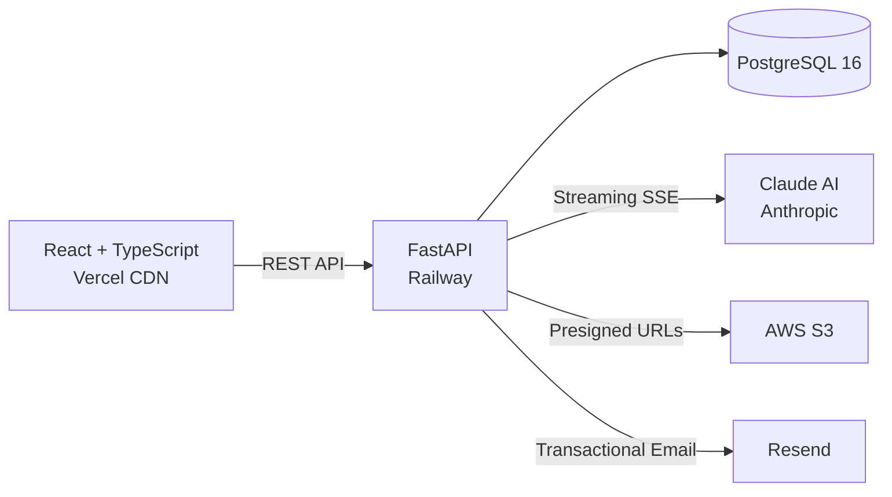

# Parcel

**Real estate deal analysis for every strategy.** Analyze deals across 5 investment strategies, manage your pipeline from lead to close, and let AI process your documents — all in one deployed platform.

**[Live Demo — parceldesk.io](https://parceldesk.io)** | Demo login: `demo@parcel.app` / `Demo1234!`

<!-- GIF: 30-second screen recording — Landing hero → Login → Dashboard with animated KPIs → Analyze Deal (Buy & Hold) → Results page with risk gauge + cash flow chart → Pipeline Kanban drag-and-drop → AI Chat streaming response → Document upload with AI analysis results. Record at 1280x720, optimize with gifsicle to <8MB. -->


---

## What It Does

Real estate investors evaluate deals differently depending on whether they're wholesaling, flipping, buying and holding, using creative finance, or executing a BRRRR strategy. Each requires different math, different risk factors, and different KPIs. Parcel handles all five in one workspace — with hand-written financial calculators, a weighted risk scoring algorithm, AI-powered document analysis, and a Kanban pipeline to track deals from lead to close.

<!-- SCREENSHOT: 2x2 grid, each 1440x900, captured with populated demo data:
  Top-left: Dashboard with KPI cards showing real numbers, activity feed with 3-4 entries
  Top-right: Deal Results page — Buy & Hold with risk gauge (score 30-40, green), cash flow chart visible
  Bottom-left: Pipeline Kanban with 4-5 cards across 3-4 stages
  Bottom-right: Document Detail view showing AI analysis results (summary, risk flags, key terms, extracted numbers)
-->

## By the Numbers

| 34 API Endpoints | 76 Automated Tests | 5 Strategy Calculators | 3 AI Integration Patterns |
|:---:|:---:|:---:|:---:|
| 9 Database Models | 18 Lazy-Loaded Pages | 7 Pipeline Stages | 22,700+ Lines of TypeScript & Python |

---

## Key Features

- **5 Investment Strategy Calculators** — Wholesale (MAO), BRRRR, creative finance (subject-to & seller finance), buy & hold, and fix & flip. Each produces strategy-specific KPIs, a 12-month cash flow projection, and a weighted risk score from 0–100 using 3–4 factors per strategy.

- **Kanban Deal Pipeline** — Drag-and-drop 7-stage board (Lead through Closed) with keyboard navigation, days-in-stage tracking, mobile-responsive tabbed fallback, and pipeline-to-portfolio close flow.

- **AI Streaming Chat** — Real-time conversations with Claude via Server-Sent Events (SSE). Attach any deal or document for context-aware analysis. Markdown rendering, conversation history, and mid-stream cancellation.

- **Document Processing Pipeline** — Upload PDFs, DOCX, or images. Claude extracts document type, parties, key terms, risk flags with severity ratings, and financial figures into structured JSON.

- **PDF Deal Reports** — One-click branded, multi-page PDF reports with strategy-specific financials, risk breakdown, and print-friendly formatting via jsPDF.

- **Portfolio Tracking** — Aggregate KPIs (total equity, monthly cash flow, annualized return), strategy breakdown charts, and editable entries updated after closing.

---

## Architecture



The frontend deploys to Vercel's global CDN. The FastAPI backend runs on Railway alongside a managed PostgreSQL instance. Documents are stored in S3 with presigned download URLs. The backend manages three distinct Claude AI integration patterns: streaming chat, background document processing, and strategy-aware offer letter generation.

---

## AI Integration Architecture

Parcel integrates Claude AI through three patterns, each solving a different product need. The approach is built around **context engineering** — assembling the right data from multiple sources at runtime and injecting it directly into the conversation.

**1. Streaming Chat with Context Engineering** — SSE via FastAPI `StreamingResponse` + `fetch` with `ReadableStream`. Deal data and document analysis are pulled from PostgreSQL and injected as structured `[DEAL CONTEXT]` blocks. An XML-structured system prompt defines domain knowledge, guardrails, and response format constraints. A rolling buffer handles SSE chunk boundary reassembly.

**2. Document Processing Pipeline** — Background task extracts text (pdfplumber for PDFs, python-docx for DOCX, Claude vision for images), then Claude returns structured JSON: document type, parties, summary, risk flags with severity, extracted numbers, and key terms. Error handling at every step — malformed JSON is caught and the document is marked failed.

**3. Strategy-Aware Offer Letter Generation** — Dynamic prompt construction extracts different financial terms per strategy (wholesale MAO vs. creative finance PITI vs. BRRRR equity captured). Claude produces professional offer letters from deal data in a single call.

**Why context injection, not RAG** — Deal analyses are ~500 tokens. Document summaries are ~800 tokens. Both fit comfortably in Claude's context window. RAG would add embedding infrastructure, vector database costs, and retrieval latency for data that doesn't need it. Start simple; add RAG when data scale demands it.

---

## Technical Decisions

**httpOnly Cookie Auth (not localStorage)** — JWTs stored in httpOnly cookies are invisible to JavaScript, preventing XSS token theft. The frontend never handles raw tokens — `credentials: 'include'` sends them automatically. A `refreshPromise` singleton prevents concurrent 401 responses from triggering multiple refresh attempts.

**JSONB for Polymorphic Strategy Data** — Each of 5 strategies has a different input/output schema. JSONB columns avoid a 50+ column table or 5 separate tables with JOINs. Adding a field to any calculator requires zero database migrations.

**Dynamic Calculator Dispatch** — `importlib.import_module()` loads the correct strategy calculator at runtime. Adding a new investment strategy requires only a new calculator module — zero changes to the API router.

**Hand-Written Financial Calculators & Risk Scoring** — All 5 strategy calculators and the weighted risk scoring algorithm are written by hand — not generated, not templated. Each strategy uses 3–4 weighted factors with industry-threshold-based point systems: DSCR thresholds, cap rate benchmarks, rehab-to-ARV ratios, spread-to-break-even margins. Wholesale uses 3 factors (40/30/30 weighting); buy & hold, BRRRR, creative finance, and flip each use 4 factors.

**Context Injection Over RAG** — Deal analyses (~500 tokens) and document summaries (~800 tokens) fit in Claude's context window. Injecting data directly avoids embedding infrastructure, vector database costs, and retrieval latency. Start simple; add RAG when data scale demands it.

---

## Tech Stack

**Frontend:** React 18 · TypeScript 5.7 (strict) · Vite 6 · TanStack Query · Zustand · Tailwind CSS · shadcn/ui · Framer Motion · Recharts · dnd-kit · Zod · jsPDF

**Backend:** Python 3.12 · FastAPI · SQLAlchemy 2 · PostgreSQL 16 · Alembic · Pydantic 2 · Anthropic Claude SDK · boto3 (S3) · Resend · bcrypt

**Infrastructure:** Vercel (frontend CDN) · Railway (backend + Postgres) · AWS S3 · GitHub Actions CI

---

## Testing

```bash
cd frontend && npm run test:run   # 44 tests across 5 suites
cd backend && pytest              # 32 tests across calculators, auth, and API endpoints
```

**76 tests total.** Frontend tests cover utility functions, Zod validation schemas for all 5 strategies, component rendering, animation hooks, and full page integration renders. Backend tests cover all 5 strategy calculators with known inputs/outputs, risk scoring edge cases, auth endpoints, and API route behavior. CI runs TypeScript checking, all tests, and a production build on every push to `main`.

---

## Built by Ivan Flores

Full-stack developer graduating December 2026 from Lakeland University. Built Parcel solo to bring real estate deal analysis into one platform — from financial modeling and risk scoring to AI-powered document processing. Bilingual in English and Spanish.

[LinkedIn](https://linkedin.com/in/ivan-flores) · [Email](mailto:ivanflores@parcel.app)

---

## License

MIT — see [LICENSE](./LICENSE).
