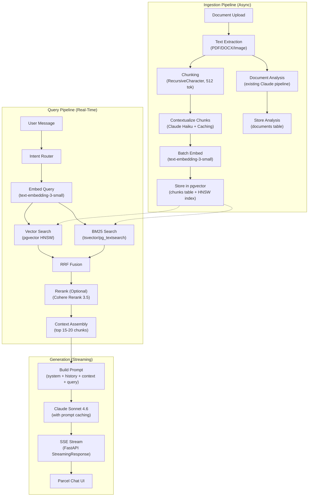

# Vector Database & RAG Architecture Research for Parcel

> Research Date: 2026-04-02
> Author: Ivan Flores
> Status: Complete
> Scope: Exhaustive technical research for supercharging Parcel's AI chat with Retrieval Augmented Generation

---

## Table of Contents

1. [Current State Analysis](#1-current-state-analysis)
2. [Vector Database Comparison](#2-vector-database-comparison)
3. [Embedding Model Selection](#3-embedding-model-selection)
4. [RAG Architecture for Real Estate](#4-rag-architecture-for-real-estate)
5. [Context Window Management](#5-context-window-management)
6. [Real Estate AI Use Cases](#6-real-estate-ai-use-cases)
7. [Production Implementation](#7-production-implementation)
8. [Cost Analysis at Scale](#8-cost-analysis-at-scale)
9. [Architecture Diagrams](#9-architecture-diagrams)
10. [Recommendation & Phased Rollout](#10-recommendation--phased-rollout)

---

## 1. Current State Analysis

### What Parcel Has Today

Parcel's AI chat is a synchronous, context-stuffing system with no retrieval layer:

- **Model**: Claude Opus 4.5 via Anthropic Python SDK
- **Streaming**: Server-Sent Events (SSE) via FastAPI `StreamingResponse`
- **Context injection**: Manual — deal inputs/outputs and document analysis summaries are appended to the user message or system prompt as text blocks
- **Document processing**: Claude extracts structured JSON (summary, risk flags, key terms, numbers) from uploaded PDFs/DOCX/images, stored in PostgreSQL JSONB columns
- **History**: Last 50 messages fetched from `chat_messages` table, sent as conversation history
- **No embeddings, no vector search, no chunking, no retrieval pipeline**

### Key Limitations

| Limitation | Impact |
|---|---|
| No raw document text stored | Chat can only reference the AI summary, not original document content |
| No cross-document search | Cannot answer "What do all my inspection reports say about roofs?" |
| No market data retrieval | Cannot reference zoning codes, market reports, or RE knowledge |
| Context stuffing only | Every query sends full deal/doc context regardless of relevance |
| No portfolio-wide queries | Cannot aggregate across deals, documents, or properties |
| 1024 max_tokens output | Limits response depth (easily fixable but indicative of conservative config) |

### What RAG Would Unlock

- Chat that knows the *full text* of every uploaded document
- Cross-document queries ("Compare all my purchase agreements")
- Market knowledge base (zoning, cap rates, market reports)
- Portfolio-wide intelligence ("Show me all deals with cap rate > 8%")
- Dramatically lower per-query cost (retrieve 5-10 chunks instead of stuffing everything)

---

## 2. Vector Database Comparison

### 2.1 pgvector (PostgreSQL Extension)

**Overview**: Open-source PostgreSQL extension adding vector similarity search directly to Postgres. The simplest option for Parcel since the backend already runs PostgreSQL on Railway.

| Attribute | Details |
|---|---|
| **Pricing** | Free (open source). Cost = existing PG infrastructure |
| **Hosting** | Same PostgreSQL instance or dedicated replica |
| **Railway support** | First-class. Railway offers one-click deploy with pgvector pre-installed (PG 16/17/18). `CREATE EXTENSION IF NOT EXISTS vector;` is all that's needed |
| **Max vectors** | No hard limit. Tested to 50M+ vectors with pgvectorscale. Practical limit is RAM/disk |
| **Index types** | IVFFlat (older, faster build), HNSW (recommended — better recall/latency), StreamingDiskANN (via pgvectorscale — best for 10M+) |
| **Query latency** | HNSW at 1M vectors: ~5-10ms p50, ~15ms p99. At 50M with pgvectorscale: ~31ms p50, ~75ms p99 at 99% recall |
| **Throughput** | pgvectorscale achieves 471 QPS at 99% recall on 50M vectors (11.4x Qdrant in this benchmark) |
| **Filtering** | Full SQL WHERE clauses — the most powerful filtering of any option. Pre-filter via SQL, then vector search |
| **Hybrid search** | tsvector/tsquery for keyword search + pgvector for semantic. ParadeDB pg_search adds true BM25. pg_textsearch adds BM25 with WAND optimization. RRF fusion in SQL |
| **Python SDK** | psycopg2/asyncpg + SQLAlchemy (Parcel already uses these). pgvector has a dedicated Python package |
| **Operational complexity** | Minimal — it's just Postgres. No new service to deploy, monitor, or pay for |
| **Community** | 13K+ GitHub stars. Massive PostgreSQL ecosystem. Active development |
| **Maturity** | Production-proven. Used by Supabase, Neon, Railway, Render |

**Key advantage for Parcel**: Zero new infrastructure. Same database, same backups, same monitoring, same Railway deployment. Vector columns live alongside deal/document tables with full ACID guarantees and JOIN capabilities.

### 2.2 Pinecone

**Overview**: Fully managed, purpose-built serverless vector database. The "AWS Lambda of vector search."

| Attribute | Details |
|---|---|
| **Pricing** | **Starter (Free)**: 2GB storage, 2M write units/mo, 1M read units/mo, 5 indexes. **Standard**: $50/mo minimum, $8.25/M reads, $2/M writes, $0.33/GB/mo storage. **Enterprise**: $500/mo minimum, 99.95% SLA, SAML SSO, HIPAA |
| **Hosting** | Managed only (AWS, GCP, Azure). No self-hosted option |
| **Max vectors** | Billions (serverless scales automatically) |
| **Query latency** | Serverless: ~30-50ms p50, ~100ms p99. Dedicated nodes: ~10ms p50 |
| **Filtering** | Metadata filtering with $eq, $ne, $gt, $lt, $in operators. Pre-filter or post-filter |
| **Hybrid search** | Sparse-dense vectors supported natively |
| **Python SDK** | Mature, well-documented. `pinecone-client` package |
| **PG integration** | None — completely separate system. Must sync data manually |
| **Operational complexity** | Near-zero ops. Fully managed. No indexing tuning needed |
| **Community** | Large commercial ecosystem. Extensive docs and tutorials |

**Cost estimate at scale**: At 100K vectors (1536d): ~$5-10/mo. At 1M vectors: ~$30-50/mo. At 10M vectors: ~$200-400/mo.

### 2.3 Weaviate

**Overview**: Open-source vector database with built-in hybrid search (vector + BM25), modular architecture, and strong multi-tenancy support.

| Attribute | Details |
|---|---|
| **Pricing** | **Self-hosted**: Free (Apache 2.0). **Cloud Flex**: $45/mo minimum, pay-as-you-go. **Cloud Plus**: Higher tiers. Storage: ~$0.095/M vector dimensions/mo (Standard support) |
| **Hosting** | Self-hosted (Docker/K8s) or Weaviate Cloud (AWS, GCP) |
| **Max vectors** | Billions (tested at scale with multi-node clusters) |
| **Query latency** | ~5-15ms p50 for filtered vector search at 1M vectors |
| **Filtering** | Rich metadata filtering with GraphQL API. Pre-filtering supported |
| **Hybrid search** | Native BM25 + vector search with configurable alpha fusion. One of the best hybrid search implementations |
| **Python SDK** | Mature `weaviate-client` v4. Async support. Good DX |
| **PG integration** | Separate system. Would need sync pipeline |
| **Operational complexity** | Moderate for self-hosted (Docker Compose or K8s). Low for cloud |
| **Community** | 12K+ GitHub stars. Active Discord. Good docs |

**Cost estimate**: At 100K vectors: ~$45/mo (cloud minimum). At 1M: ~$60-80/mo. At 10M: ~$200-300/mo. Self-hosted crossover is ~5M vectors.

### 2.4 Qdrant

**Overview**: High-performance vector database written in Rust. Excellent memory efficiency and advanced filtering capabilities.

| Attribute | Details |
|---|---|
| **Pricing** | **Free tier**: 1GB RAM, 0.5 vCPU (perpetual, ~100K vectors). **Cloud Standard**: $150-200/mo for 8GB/2vCPU cluster. **Self-hosted**: Free (Apache 2.0) |
| **Hosting** | Self-hosted (Docker/K8s), Qdrant Cloud, or Hybrid Cloud (BYOC) |
| **Max vectors** | Billions. Segment-based storage architecture. On-disk HNSW option reduces cost 60-80% |
| **Query latency** | 4.74ms p50, 5.79ms p99 at 50M vectors at 90% recall. Best raw latency of purpose-built DBs |
| **Filtering** | Advanced payload filtering. Boolean combinations. Nested object filtering. Pre-filtering with index |
| **Hybrid search** | Sparse vectors for BM25-like search. Fusion strategies supported |
| **Python SDK** | Excellent `qdrant-client` with async support. gRPC and REST APIs |
| **PG integration** | Separate system |
| **Operational complexity** | Moderate. Rust binary is resource-efficient. Docker deployment straightforward |
| **Community** | 22K+ GitHub stars. Very active development. Strong Rust performance reputation |

**Cost estimate**: At 100K vectors: Free tier. At 1M: $50-100/mo (cloud) or $20-40/mo (self-hosted small VM). At 10M: $150-200/mo cloud.

### 2.5 ChromaDB

**Overview**: Lightweight, Python-native vector database. Designed for simplicity and rapid prototyping. Runs embedded in-process or as client-server.

| Attribute | Details |
|---|---|
| **Pricing** | **Open source**: Free (embedded mode). **Chroma Cloud Starter**: $0/mo + $5 free credits. Usage: $2.50/GiB written, $0.33/GiB/mo storage, $0.0075/TiB queried. **Team**: $250/mo + $100 credits |
| **Hosting** | Embedded (in-process), client-server (Docker), or Chroma Cloud |
| **Max vectors** | Millions comfortably in embedded mode on 4-8GB RAM. Cloud: terabytes |
| **Query latency** | ~5-20ms p50 for embedded mode at 1M vectors |
| **Filtering** | Metadata filtering with where/where_document clauses |
| **Hybrid search** | Full-text search + vector search in Cloud. Basic in open source |
| **Python SDK** | Excellent. `chromadb` package. Pythonic API. Zero config for embedded |
| **PG integration** | Separate system, but embedded mode means no extra service |
| **Operational complexity** | Extremely low for embedded. Just `pip install chromadb` |
| **Community** | 18K+ GitHub stars. Very popular in tutorials and prototypes |

**Example Cloud cost**: 1M docs written, 6M stored, 10M queries = ~$79/mo.

**Limitation**: Thin enterprise features compared to Qdrant or Pinecone. Less suitable for 10M+ vectors.

### 2.6 Milvus / Zilliz Cloud

**Overview**: Enterprise-grade open-source vector database. Most mature at billion-scale. Zilliz Cloud is the managed offering.

| Attribute | Details |
|---|---|
| **Pricing** | **Self-hosted Milvus**: Free (Apache 2.0). **Zilliz Free tier**: 5GB storage, 2.5M vCUs. **Serverless**: $4/M vCUs. **Dedicated**: from $155/mo. 30-day free trial |
| **Hosting** | Self-hosted (K8s required for production), Zilliz Cloud (AWS, GCP, Azure) |
| **Max vectors** | Billions to trillions. Designed for enterprise scale |
| **Query latency** | ~5-15ms p50 at 1M vectors. Optimized for throughput at scale |
| **Filtering** | Rich attribute filtering. Boolean expressions. Array and JSON field support |
| **Hybrid search** | Dense + sparse vector search. BM25 integration |
| **Python SDK** | `pymilvus` — mature but more complex API surface than competitors |
| **PG integration** | Separate system. Complex K8s deployment for self-hosted |
| **Operational complexity** | High for self-hosted (etcd + MinIO + K8s). Low for Zilliz Cloud |
| **Community** | 40K+ GitHub stars. Largest open-source vector DB community |

**Cost estimate**: Zilliz Serverless at 1M vectors: ~$30-60/mo. Dedicated at 10M: ~$200-400/mo.

**Overkill for Parcel's current scale** but relevant if aiming for massive multi-tenant deployment.

### 2.7 Turbopuffer

**Overview**: Serverless vector search built on object storage (S3/GCS). 10-100x cheaper storage than in-memory alternatives. Powers Cursor and Notion.

| Attribute | Details |
|---|---|
| **Pricing** | **Launch**: $64/mo minimum. **Scale**: $256/mo minimum + SSO, HIPAA. **Enterprise**: $4,096/mo minimum + single-tenant. Storage: ~$0.02/GB (object storage). Queries: tiered, with 80-96% marginal discounts at scale. No free tier |
| **Hosting** | Managed only (multi-tenant or single-tenant) |
| **Max vectors** | Billions. Handles 2.5T+ documents, 10M+ writes/s in production |
| **Query latency** | Sub-10ms p50 for warm data. Cold data latency higher (object storage fetch) |
| **Filtering** | Metadata filtering on scalar attributes |
| **Hybrid search** | Both vector and BM25 indexes supported natively |
| **Python SDK** | `turbopuffer` package. TypeScript and Go SDKs also available |
| **PG integration** | Separate system |
| **Operational complexity** | Zero ops. Fully serverless. Automatic scaling |
| **Community** | Smaller but rapidly growing. Used by high-profile AI companies |

**Unique value**: Object-storage-first architecture means storage costs are 10-100x lower than RAM-based alternatives. Best cost profile for large, infrequently-accessed corpora.

**Caveat**: Query billing is based on namespace size, not data touched. A query against a 10GB namespace is charged for 10GB scanned regardless of how many results are returned.

### 2.8 LanceDB

**Overview**: Embedded, serverless vector database built on Lance columnar format. Zero-copy, automatic versioning.

| Attribute | Details |
|---|---|
| **Pricing** | **OSS**: Free, fully featured. **Cloud**: ~$16/mo starting, usage-based (writes + queries + storage). $100 free credits. **Enterprise**: Custom |
| **Hosting** | Embedded (in-process like SQLite), or LanceDB Cloud (public beta) |
| **Max vectors** | Billions. AWS Architecture Blog: 1B+ vectors on S3 with LanceDB |
| **Query latency** | Millisecond-level for embedded. Competitive with purpose-built DBs |
| **Filtering** | SQL-based filtering. Full-text search. Hybrid search |
| **Hybrid search** | Vector + full-text search + SQL all native |
| **Python SDK** | `lancedb` package. Also Rust and TypeScript. Good DX |
| **PG integration** | Separate system, but embedded mode is zero-infra |
| **Operational complexity** | Extremely low for OSS (embedded). Cloud is fully managed |
| **Community** | 6K+ GitHub stars. Growing. Backed by established team |

**Interesting for Parcel**: Embedded mode means no separate vector DB service. Runs in-process with the FastAPI app. Lance format on disk or S3.

**Caveat**: Cloud is still in public beta. Embedded mode ties vector storage to app server lifecycle.

---

### 2.9 Comparison Matrix

#### Cost at Scale (Managed/Cloud, estimated monthly)

| Database | 100K vectors | 1M vectors | 10M vectors | Notes |
|---|---|---|---|---|
| **pgvector** | $0 (existing PG) | $0 (existing PG) | $20-50 (larger instance) | Cost = marginal PG resource usage |
| **Pinecone** | $5-10 | $30-50 | $200-400 | Serverless, pay-per-request |
| **Weaviate Cloud** | $45 (minimum) | $60-80 | $200-300 | Cloud minimum applies |
| **Qdrant Cloud** | $0 (free tier) | $50-100 | $150-200 | Free tier covers 100K |
| **ChromaDB Cloud** | $5-15 | $30-80 | $150-250 | Usage-based, Starter is free |
| **Zilliz (Milvus)** | $0 (free tier) | $30-60 | $200-400 | Serverless pricing |
| **Turbopuffer** | $64 (minimum) | $64 (minimum) | $64-150 | Storage is cheap, minimum applies |
| **LanceDB Cloud** | $16-20 | $20-40 | $50-150 | Very competitive at scale |
| **LanceDB OSS** | $0 | $0 | $0 (disk cost) | Embedded, no service cost |

#### Feature Matrix

| Feature | pgvector | Pinecone | Weaviate | Qdrant | Chroma | Milvus | Turbopuffer | LanceDB |
|---|---|---|---|---|---|---|---|---|
| Hybrid search (BM25+vector) | Via extensions | Native | Native | Sparse vectors | Cloud only | Native | Native | Native |
| Metadata filtering | SQL (best) | Good | Good | Excellent | Basic | Good | Good | SQL-based |
| Multi-tenancy | Via schemas/RLS | Namespaces | Native | Collections | Databases | Partitions | Namespaces | Tables |
| ACID transactions | Yes | No | No | No | No | No | No | Versioned |
| JOIN with app data | Yes (same DB) | No | No | No | No | No | No | No |
| Railway deployable | One-click | N/A (managed) | Docker (DIY) | Docker (DIY) | Embedded OK | Complex | N/A (managed) | Embedded OK |
| Self-hosted option | Yes (PG ext) | No | Yes | Yes | Yes | Yes | No | Yes |

#### Best Fit by Use Case

| Use Case | Recommended | Reason |
|---|---|---|
| Parcel MVP (< 1M vectors) | **pgvector** | Zero new infra, Railway native, JOINs with deals/docs |
| Parcel at scale (1-10M vectors) | **pgvector + pgvectorscale** | Stays in PG, StreamingDiskANN handles scale |
| If Parcel needs dedicated vector infra | **Qdrant Cloud** or **Turbopuffer** | Qdrant for best raw latency, Turbopuffer for best cost |
| Maximum simplicity (prototype) | **ChromaDB** embedded or **LanceDB** OSS | In-process, zero config |
| Enterprise multi-tenant SaaS | **Pinecone** or **Milvus/Zilliz** | Battle-tested managed services |

---

## 3. Embedding Model Selection

### 3.1 Model Comparison

| Model | Provider | Dimensions | MTEB Score | Cost (per 1M tokens) | Max Input | Notes |
|---|---|---|---|---|---|---|
| text-embedding-3-small | OpenAI | 1536 | 62.3 | $0.02 | 8191 tokens | Best cost/quality ratio. Recommended starting point |
| text-embedding-3-large | OpenAI | 3072 | 64.6 | $0.13 | 8191 tokens | Higher quality, 6.5x cost. Supports dimension reduction |
| text-embedding-ada-002 | OpenAI | 1536 | 61.0 | $0.10 | 8191 tokens | Legacy. Superseded by 3-small |
| embed-english-v3.0 | Cohere | 1024 | 64.5 | $0.10 | 512 tokens | Excellent quality. Multilingual. Shorter max input |
| embed-v4 (multimodal) | Cohere | 1024 | 65.2 | $0.12 | 512 tokens | MTEB leader. Multimodal (text+image) |
| voyage-3.5 | Voyage AI | 1024 | ~64 | $0.06 | 32K tokens | Best long-document support. 200M free tokens |
| BGE-M3 | BAAI (OSS) | 1024 | 63.0 | Free (self-host) | 8192 tokens | Best open-source. Multi-lingual, multi-granularity |
| nomic-embed-text-v2 | Nomic AI (OSS) | 768 | ~62 | Free (self-host) | 8192 tokens | MoE architecture. 100+ languages |
| all-MiniLM-L6-v2 | Sentence Transformers (OSS) | 384 | ~56 | Free (self-host) | 256 tokens | Fast, tiny, good for prototyping. Low quality |
| Gemini Embedding 2 | Google | 3072 | ~65 | $0.006-0.01 | 8192 tokens | Newest. 5 modalities. Cheapest per token. MRL support |

### 3.2 Recommendation for Parcel

**Start with: `text-embedding-3-small` (OpenAI)**

Rationale:
- $0.02/M tokens is extremely cheap (100K documents at 2K tokens each = $4 one-time embedding cost)
- 1536 dimensions is a good balance of quality and storage
- 62.3 MTEB is adequate for real estate domain text
- Supports dimension reduction (can shrink to 512d or 256d to save storage)
- Excellent Python SDK, widely tested in production
- Compatible with all vector databases listed above

**Upgrade path: `voyage-3.5` or `embed-v4` (Cohere)**

- If retrieval quality becomes a bottleneck, Voyage 3.5 ($0.06/M) or Cohere v4 ($0.12/M) offer meaningfully better scores
- Voyage 3.5 has 32K token input — can embed entire documents without chunking in some cases
- Both offer free tiers generous enough for initial testing (200M tokens for Voyage)

**Self-hosted option: `BGE-M3`**

- If Parcel wants to eliminate third-party API dependency for embeddings
- Run on a GPU instance or use CPU with quantization
- 63.0 MTEB matches commercial options
- Adds infra complexity but zero per-token cost

### 3.3 Domain Relevance for Real Estate

Real estate documents contain a mix of:
- **Legal terminology** (deed, lien, easement, conveyance) — needs good vocabulary coverage
- **Financial metrics** (cap rate, NOI, DSCR, LTV) — needs number understanding
- **Geographic specifics** (addresses, county names, zoning codes) — needs entity recognition
- **Conversational queries** ("Is this a good deal?") — needs semantic understanding

General-purpose embedding models handle all of these adequately. Domain-specific fine-tuning is **not recommended** at Parcel's current scale — the marginal quality gain doesn't justify the engineering investment. Voyage AI's `voyage-finance-2` model could be worth testing since real estate investing overlaps heavily with finance.

---

## 4. RAG Architecture for Real Estate

### 4.1 What Data Should Be Embedded

| Data Source | Priority | Chunk Strategy | Metadata per Chunk | Update Frequency |
|---|---|---|---|---|
| **Uploaded documents** (PDFs, contracts, inspection reports, appraisals) | P0 — Highest | Recursive 512 tokens, 10% overlap | user_id, deal_id, doc_id, doc_type, upload_date, page_number | On upload |
| **Deal memos & analysis notes** | P0 | Per-field (address, strategy, key findings) | user_id, deal_id, strategy, market | On deal save |
| **Chat history** (for context continuity) | P1 | Per-message or per-session summary | user_id, session_id, timestamp, context_type | On message save |
| **Knowledge base articles** (RE investing education) | P1 | Recursive 512 tokens | topic, category, difficulty, last_updated | On publish/edit |
| **User portfolio data** (properties, tenants, financials) | P2 | Per-property structured | user_id, property_id, market, strategy | On data change |
| **Market reports & analysis** | P2 | Section-level or page-level | market, date, source, report_type | On ingest/quarterly |
| **Zoning regulations & municipal codes** | P3 | Section + subsection | municipality, zone_code, effective_date | Quarterly refresh |
| **Property listings** | P3 | Per-listing | market, price_range, property_type, date | Daily/weekly sync |

### 4.2 Chunking Strategies

#### Recommended Default: Recursive Character Splitting

```python
from langchain.text_splitter import RecursiveCharacterTextSplitter

splitter = RecursiveCharacterTextSplitter(
    chunk_size=512,       # ~512 tokens
    chunk_overlap=50,     # 10% overlap
    separators=["\n\n", "\n", ". ", " ", ""],
    length_function=len,  # or tiktoken token counter
)
```

**Why 512 tokens?**
- Sweet spot for retrieval quality (per Chroma's 2025 research and NVIDIA benchmarks)
- Below the ~2,500 token "context cliff" where response quality degrades
- Small enough for precise retrieval, large enough to contain meaningful content
- 15% overlap (NVIDIA's optimal finding) helps with cross-chunk continuity

#### Document-Type-Specific Strategies

| Document Type | Chunking Approach | Chunk Size | Metadata |
|---|---|---|---|
| **Purchase agreements** | Section-based (Article/Clause boundaries) | 300-500 tokens | section_name, clause_number |
| **Inspection reports** | Component-based (Roof, Foundation, Electrical, etc.) | 500-800 tokens | component, severity, page |
| **Leases** | Clause-based | 300-500 tokens | clause_type (rent, term, maintenance) |
| **Appraisals** | Section-based (Comparables, Adjustments, Value) | 500-1000 tokens | section, property_address |
| **Market reports** | Paragraph/section-based | 500-700 tokens | market, metric_type, date |
| **Zoning codes** | Section + subsection hierarchical | 300-500 tokens | zone, use_type, regulation_type |
| **Deal analysis notes** | Per-paragraph or whole note | Variable | deal_id, author, date |

#### Metadata Enrichment per Chunk

Every chunk should carry structured metadata for filtering:

```python
chunk_metadata = {
    "user_id": "uuid",              # Multi-tenant isolation
    "source_type": "document",       # document, deal, knowledge_base, market_report
    "source_id": "uuid",            # document_id, deal_id, etc.
    "document_type": "inspection_report",
    "deal_id": "uuid",              # Optional — links chunk to a deal
    "page_number": 3,
    "section": "Roof Assessment",
    "created_at": "2026-03-15T10:00:00Z",
    "market": "Columbus, OH",
    "chunk_index": 7,               # Position within source document
    "total_chunks": 24,             # Total chunks in source document
}
```

### 4.3 Retrieval Strategies

#### Strategy 1: Semantic Search (Pure Vector Similarity)

The baseline. Embed the user query, find nearest neighbors by cosine similarity.

**When to use**: General questions, conceptual queries ("What makes a good BRRRR deal?").

**Limitation**: Misses exact terms. "Error code TS-999" or "Section 4.2(b)" won't match semantically.

#### Strategy 2: Hybrid Search (Vector + BM25 Keyword)

Run both dense vector search and sparse BM25 keyword search in parallel, then fuse results using Reciprocal Rank Fusion (RRF).

**When to use**: Most queries. This is the **recommended default** for real estate because:
- Contracts have specific clause references ("Section 7.3")
- Users search by address, parcel number, or property name (exact match needed)
- Financial terms need both semantic understanding and keyword precision

```python
def hybrid_search(query: str, user_id: str, k: int = 20) -> list[Chunk]:
    """Run parallel vector + BM25 search and fuse with RRF."""
    # Dense retrieval
    query_embedding = embed(query)
    vector_results = vector_search(query_embedding, user_id, k=k)

    # Sparse retrieval (BM25)
    bm25_results = bm25_search(query, user_id, k=k)

    # Reciprocal Rank Fusion
    return reciprocal_rank_fusion(vector_results, bm25_results, k=60)


def reciprocal_rank_fusion(
    *result_lists: list[Chunk], k: int = 60
) -> list[Chunk]:
    """Fuse multiple ranked lists using RRF. k=60 is standard."""
    scores: dict[str, float] = {}
    for results in result_lists:
        for rank, chunk in enumerate(results):
            scores[chunk.id] = scores.get(chunk.id, 0) + 1.0 / (k + rank + 1)
    return sorted(scores.items(), key=lambda x: x[1], reverse=True)
```

#### Strategy 3: Re-ranking

After initial retrieval (top 100-150 candidates), apply a cross-encoder reranker to re-score relevance, then take top 10-20 for the LLM context.

**Models**:
- **Cohere Rerank 3.5**: $2.00 per 1,000 searches. Production-proven, easy API
- **Voyage Rerank 2.5**: $2.00 per 1,000 searches. 200M free tokens
- **BGE-Reranker-v2-m3**: Free (self-hosted). Good quality, requires GPU
- **Cross-encoder/ms-marco-MiniLM-L-6-v2**: Free (self-hosted). Lightweight, fast

**When to use**: When retrieval precision matters (document Q&A, legal clause lookup). Adds 80-150ms latency at p99 but significantly improves answer quality.

**Production recipe**: Retrieve top 100 via hybrid search, rerank to top 20, pass to Claude.

#### Strategy 4: Multi-Query Retrieval

Use Claude to reformulate the user's question into 3-5 variant queries, run each independently, then fuse all results.

**When to use**: Complex or ambiguous queries ("How does this deal compare to my best performers?"). Adds one LLM call (~200-500ms) but dramatically improves recall.

```python
MULTI_QUERY_PROMPT = """Generate 3 different search queries that would help
answer the user's question. Each query should approach the topic from a
different angle. Return only the queries, one per line.

User question: {question}"""

async def multi_query_retrieve(question: str, user_id: str) -> list[Chunk]:
    queries = await generate_sub_queries(question)  # Claude Haiku call
    all_results = []
    for q in queries:
        results = await hybrid_search(q, user_id, k=20)
        all_results.extend(results)
    # Deduplicate and re-rank
    unique = deduplicate(all_results)
    return rerank(question, unique, top_k=20)
```

#### Strategy 5: Contextual Retrieval (Anthropic's Approach)

Prepend a short contextual description to each chunk *before embedding*, generated by an LLM that has seen the full document.

**How it works**:
1. For each chunk, send the full document + the chunk to Claude Haiku
2. Claude generates 50-100 tokens of context (e.g., "This chunk is from a property inspection report for 123 Main St, Columbus OH, specifically discussing the roof condition assessment")
3. Prepend this context to the chunk before embedding
4. At query time, the embedding captures both the chunk content and its document-level context

**Performance**:
- Contextual Embeddings alone: **35% reduction** in retrieval failures
- Combined with BM25: **49% reduction**
- With reranking added: **67% reduction** in failed retrievals

**Cost**: $1.02 per million document tokens (using Claude Haiku with prompt caching). For 100K documents at 2K tokens each = ~$0.20 one-time cost.

**Recommendation**: Implement this. The quality improvement is dramatic and the cost is trivial with prompt caching.

```python
CONTEXT_PROMPT = """<document>
{full_document}
</document>
Here is the chunk we want to situate within the whole document:
<chunk>
{chunk_content}
</chunk>
Please give a short succinct context to situate this chunk within the
overall document for the purposes of improving search retrieval of the
chunk. Answer only with the succinct context and nothing else."""

async def contextualize_chunk(chunk: str, full_doc: str) -> str:
    """Use Claude Haiku to generate context for a chunk."""
    response = await anthropic_client.messages.create(
        model="claude-haiku-4.5",
        max_tokens=150,
        messages=[{
            "role": "user",
            "content": CONTEXT_PROMPT.format(
                full_document=full_doc,
                chunk_content=chunk
            ),
        }],
        # Use prompt caching — the full_doc is the same for all chunks
        # in a document, so we only pay the write cost once
    )
    context = response.content[0].text
    return f"{context}\n\n{chunk}"  # Prepend context to chunk
```

#### Recommended Strategy Stack for Parcel

```
Layer 1: Contextual Retrieval (at embedding time)
    |
    v
Layer 2: Hybrid Search (vector + BM25, parallel)
    |
    v
Layer 3: Reciprocal Rank Fusion (merge results)
    |
    v
Layer 4: Re-ranking (Cohere Rerank 3.5 on top 100 → top 20)
    |
    v
Layer 5: Context Assembly (stuff top 20 chunks into Claude prompt)
```

Expected performance: **67% fewer failed retrievals** vs. naive vector search, per Anthropic's benchmarks.

---

## 5. Context Window Management

### 5.1 RAG vs. Long Context Window

Claude Opus 4.5 (Parcel's current model) has a 200K token context window. Newer models (Opus 4.6, Sonnet 4.6) support 1M tokens. The question is: when does RAG beat just stuffing the full context?

#### Cost Comparison

| Approach | Tokens per Query | Cost per Query (Sonnet 4.6) | 1,000 queries/day | Monthly cost |
|---|---|---|---|---|
| **Full context (100K tokens)** | 100,000 input | $0.30 | $300/day | **$9,000/mo** |
| **Full context (200K tokens)** | 200,000 input | $0.60 | $600/day | **$18,000/mo** |
| **RAG (5-20 chunks)** | 5,000-10,000 input | $0.015-$0.03 | $15-30/day | **$450-$900/mo** |
| **RAG + prompt caching** | 5,000 input (cached system prompt) | $0.005-$0.015 | $5-15/day | **$150-$450/mo** |

**RAG is 10-60x cheaper** at Parcel's likely query volume.

#### Latency Comparison

| Approach | Time to First Token | Full Response Time |
|---|---|---|
| Long context (100K tokens) | 10-30 seconds | 30-60 seconds |
| RAG pipeline (retrieval + generation) | 0.5-1.5 seconds | 2-5 seconds |

**RAG is 10-20x faster** for time-to-first-token.

#### When Long Context Wins

- **Small corpus per query** (< 50K tokens total) — e.g., single document analysis
- **Low query volume** (< 50 queries/day) — fixed costs of RAG infra exceed savings
- **Coherence-critical tasks** — narrative summarization of a single long document
- **One-off analysis** — "Summarize this entire 50-page contract" (no retrieval needed)

#### When RAG Wins (Parcel's Situation)

- **Large corpus** — user has 10-100+ documents across multiple deals
- **Frequent queries** — active users ask multiple questions per session
- **Cross-document queries** — "What do all my inspection reports say about foundations?"
- **Mixed data sources** — documents + deal data + knowledge base + market data
- **Latency-sensitive** — chat should feel responsive (< 3s to first token)

### 5.2 Token Budget Allocation

For a typical RAG-powered chat message, allocate the context window budget:

```
Total budget: 8,000-15,000 input tokens (targeting low cost + fast response)

System prompt:           ~800 tokens  (Parcel's RE specialist persona + instructions)
Retrieved chunks:      ~4,000-8,000 tokens  (10-20 chunks at 200-500 tokens each)
Conversation history:  ~2,000-4,000 tokens  (last 5-10 messages)
User message:            ~200 tokens  (current question)
Deal context (if any):   ~500 tokens  (structured deal data)
-------------------------------------------------------
Total:                 ~7,500-13,500 tokens
```

### 5.3 Hybrid Approach (Recommended)

Use RAG for retrieval across the corpus, then stuff relevant chunks into a moderate context:

1. **System prompt** (cached with 1-hour caching): RE specialist persona — ~800 tokens
2. **Retrieved context** (dynamic per query): Top 10-20 most relevant chunks — ~4,000-8,000 tokens
3. **Conversation history** (sliding window): Last 5-10 messages — ~2,000-4,000 tokens
4. **Structured context** (deal/property data): If in deal context — ~500 tokens

With prompt caching on the system prompt, the cached portion (800 tokens) costs 0.1x, and subsequent messages in the same conversation benefit from automatic caching of prior turns.

### 5.4 Conversation History Strategy

**Problem**: As conversations grow, history consumes the token budget.

**Solution**: Sliding window with summarization.

```python
MAX_HISTORY_TOKENS = 4000

def prepare_history(messages: list[dict], max_tokens: int = MAX_HISTORY_TOKENS) -> list[dict]:
    """Keep recent messages within token budget. Summarize if needed."""
    recent = messages[-10:]  # Last 10 messages
    token_count = count_tokens(recent)

    if token_count <= max_tokens:
        return recent

    # Summarize older messages, keep last 3-5 verbatim
    older = messages[:-5]
    recent_verbatim = messages[-5:]

    summary = summarize_conversation(older)  # Claude Haiku call
    return [
        {"role": "user", "content": f"[Previous conversation summary: {summary}]"},
        *recent_verbatim,
    ]
```

---

## 6. Real Estate AI Use Cases

### Use Case 1: "What are the zoning requirements for this address?"

**RAG Architecture**:
```
User query → Embed query
  → Vector search: zoning_codes collection, filter by municipality
  → BM25 search: exact zone code lookup (e.g., "R-4 residential")
  → Fuse + Rerank → Top 10 zoning chunks
  → Claude: Synthesize answer with specific code references
```

**Data needed**: Municipal zoning code documents, chunked by section. Metadata: municipality, zone_code, use_type.

**Special consideration**: Zoning codes change. Need periodic re-ingestion (quarterly) with date metadata for freshness.

### Use Case 2: "Summarize all my deals in Columbus, OH"

**RAG Architecture**:
```
User query → Identify intent: portfolio summary
  → Structured query: SELECT deals WHERE market = 'Columbus, OH'
  → For each deal: Embed deal summary, retrieve key chunks
  → Claude: Synthesize portfolio overview with aggregated metrics
```

**Hybrid approach**: This is partly a database query (structured deal data) and partly RAG (pulling context from analysis notes, documents). Use SQL for deal records, RAG for supplemental context.

### Use Case 3: "What does my inspection report say about the roof?"

**RAG Architecture**:
```
User query → Embed "inspection report roof condition"
  → Vector search: documents collection, filter by {user_id, document_type: "inspection_report", deal_id}
  → BM25 search: keyword "roof" in document chunks
  → Fuse + Rerank → Top 5 roof-related chunks
  → Claude: Answer with specific findings, quotes from report
```

**This is the flagship use case** — Parcel currently only has the AI summary, not the raw document text. RAG unlocks direct answers from the original document content.

### Use Case 4: "Compare this deal to my best-performing properties"

**RAG Architecture**:
```
User query → Identify intent: comparative analysis
  → Step 1: SQL query for user's properties sorted by performance metrics
  → Step 2: Retrieve current deal's full context (chunks from documents + deal data)
  → Step 3: Retrieve best-performing deals' contexts
  → Claude: Comparative analysis with specific metrics
```

**Multi-step retrieval**: This requires both structured data (deal metrics for ranking) and unstructured data (deal notes, documents for context).

### Use Case 5: "What's the typical cap rate in [neighborhood]?"

**RAG Architecture**:
```
User query → Embed "cap rate [neighborhood]"
  → Vector search: market_reports collection, filter by market
  → Vector search: knowledge_base collection, filter by topic="cap_rates"
  → Fuse + Rerank → Top 10 chunks about local cap rates
  → Claude: Synthesize market data with caveats about data freshness
```

**Data needed**: Market reports, knowledge base articles, potentially third-party data feeds.

### Use Case 6: AI Chat That Knows the Entire Portfolio

**RAG Architecture**:
```
Every user message → Route by intent:
  ├── Document question → Document RAG pipeline
  ├── Deal question → Deal context + document RAG
  ├── Portfolio question → SQL aggregation + RAG context
  ├── Market question → Market data RAG
  ├── Education question → Knowledge base RAG
  └── General RE question → Knowledge base RAG (or no retrieval)
```

**Implementation**: Intent classifier (can be Claude Haiku or a simple keyword/embedding router) determines which retrieval pipeline to invoke. Most queries hit the document pipeline.

### Use Case 7: Automated Deal Scoring

**Architecture** (background job, not real-time chat):
```
New deal submitted → Extract inputs
  → RAG: Retrieve similar past deals by the user
  → RAG: Retrieve market data for the deal's location
  → Claude: Score deal relative to user's historical preferences
  → Store score + reasoning in deal record
```

This is a **batch RAG** application — runs asynchronously when deals are created/updated.

### Use Case 8: Smart Property Alerts

**Architecture** (event-driven):
```
New listing ingested → Embed listing description
  → For each user with alerts enabled:
    → Vector search: user's portfolio + preferences
    → Compare listing embedding to user's "ideal deal" profile
    → If similarity > threshold:
      → Claude: Generate personalized alert with analysis
      → Send notification
```

This is a **reverse search** — instead of user querying the corpus, the corpus queries user preferences.

---

## 7. Production Implementation

### 7.1 Embedding Pipeline Architecture

#### When to Embed

| Trigger | Data Type | Approach |
|---|---|---|
| **On document upload** | PDF, DOCX, images | Async background task (FastAPI BackgroundTasks or Celery) |
| **On deal save** | Deal inputs/outputs | Inline or async (small data, fast) |
| **On knowledge base update** | Articles, guides | Async batch job |
| **On schedule** | Market reports, zoning codes | Cron job (weekly/quarterly) |
| **On model change** | All data | Batch re-embedding pipeline |

#### Pipeline Code (FastAPI + pgvector)

```python
# backend/core/embeddings/pipeline.py

import asyncio
import hashlib
import logging
from typing import Optional

import numpy as np
from openai import AsyncOpenAI
from sqlalchemy.ext.asyncio import AsyncSession

from backend.models.chunks import DocumentChunk
from backend.core.embeddings.chunker import chunk_document

logger = logging.getLogger(__name__)
openai_client = AsyncOpenAI()

EMBEDDING_MODEL = "text-embedding-3-small"
EMBEDDING_DIMENSIONS = 1536
BATCH_SIZE = 100  # OpenAI allows up to 2048 inputs per batch


async def embed_texts(texts: list[str]) -> list[list[float]]:
    """Embed a batch of texts using OpenAI. Returns list of vectors."""
    response = await openai_client.embeddings.create(
        model=EMBEDDING_MODEL,
        input=texts,
        dimensions=EMBEDDING_DIMENSIONS,
    )
    return [item.embedding for item in response.data]


async def process_document_for_rag(
    document_id: str,
    document_text: str,
    metadata: dict,
    db: AsyncSession,
) -> int:
    """Chunk, contextualize, embed, and store a document for RAG.

    Returns the number of chunks created.
    """
    # Step 1: Chunk the document
    chunks = chunk_document(document_text, metadata.get("document_type"))

    # Step 2: Contextualize each chunk (Anthropic's approach)
    contextualized = await contextualize_chunks(chunks, document_text)

    # Step 3: Embed in batches
    all_embeddings = []
    for i in range(0, len(contextualized), BATCH_SIZE):
        batch = contextualized[i : i + BATCH_SIZE]
        embeddings = await embed_texts(batch)
        all_embeddings.extend(embeddings)

    # Step 4: Store chunks + embeddings in pgvector
    for i, (chunk_text, embedding) in enumerate(
        zip(contextualized, all_embeddings)
    ):
        chunk = DocumentChunk(
            document_id=document_id,
            user_id=metadata["user_id"],
            chunk_index=i,
            content=chunk_text,
            embedding=embedding,
            metadata_={
                **metadata,
                "chunk_index": i,
                "total_chunks": len(chunks),
                "content_hash": hashlib.md5(chunk_text.encode()).hexdigest(),
            },
        )
        db.add(chunk)

    await db.commit()
    logger.info(
        "Processed document %s: %d chunks embedded", document_id, len(chunks)
    )
    return len(chunks)
```

#### Chunk Storage Model (pgvector)

```python
# backend/models/chunks.py

from pgvector.sqlalchemy import Vector
from sqlalchemy import Column, ForeignKey, Integer, String, Text
from sqlalchemy.dialects.postgresql import JSONB, UUID
from sqlalchemy.orm import relationship

from database import Base
from models.base import TimestampMixin


class DocumentChunk(TimestampMixin, Base):
    """A chunk of embedded document text for RAG retrieval."""

    __tablename__ = "document_chunks"

    user_id = Column(
        UUID(as_uuid=True), ForeignKey("users.id"),
        nullable=False, index=True,
    )
    document_id = Column(
        UUID(as_uuid=True), ForeignKey("documents.id"),
        nullable=True, index=True,
    )
    deal_id = Column(
        UUID(as_uuid=True), ForeignKey("deals.id"),
        nullable=True, index=True,
    )
    source_type = Column(
        String(50), nullable=False, default="document",
        index=True,
    )  # document, deal, knowledge_base, market_report
    chunk_index = Column(Integer, nullable=False)
    content = Column(Text, nullable=False)
    embedding = Column(Vector(1536), nullable=False)  # pgvector column
    metadata_ = Column("metadata", JSONB, nullable=True)
    embedding_model = Column(
        String(100), nullable=False, default="text-embedding-3-small",
    )

    # Relationships
    user = relationship("User")
    document = relationship("Document")
    deal = relationship("Deal")
```

#### pgvector Index Creation

```sql
-- HNSW index for approximate nearest neighbor search
-- m=16, ef_construction=200 are good defaults for <10M vectors
CREATE INDEX idx_chunks_embedding_hnsw
ON document_chunks
USING hnsw (embedding vector_cosine_ops)
WITH (m = 16, ef_construction = 200);

-- Composite index for filtered search (user_id + vector)
-- pgvector 0.7+ supports this
CREATE INDEX idx_chunks_user_embedding
ON document_chunks
USING hnsw (embedding vector_cosine_ops)
WHERE user_id IS NOT NULL;

-- BM25 full-text search index (using tsvector or pg_textsearch)
ALTER TABLE document_chunks ADD COLUMN content_tsv tsvector
    GENERATED ALWAYS AS (to_tsvector('english', content)) STORED;
CREATE INDEX idx_chunks_content_fts ON document_chunks USING gin(content_tsv);
```

### 7.2 Retrieval Service

```python
# backend/core/rag/retriever.py

from dataclasses import dataclass
from typing import Optional

from sqlalchemy import text
from sqlalchemy.ext.asyncio import AsyncSession

from backend.core.embeddings.pipeline import embed_texts


@dataclass
class RetrievedChunk:
    id: str
    content: str
    score: float
    metadata: dict
    source_type: str


async def hybrid_search(
    query: str,
    user_id: str,
    db: AsyncSession,
    source_types: Optional[list[str]] = None,
    deal_id: Optional[str] = None,
    document_id: Optional[str] = None,
    k: int = 20,
) -> list[RetrievedChunk]:
    """Hybrid vector + BM25 search with RRF fusion."""

    # Embed the query
    query_embedding = (await embed_texts([query]))[0]

    # Build filter clauses
    filters = ["c.user_id = :user_id"]
    params = {"user_id": user_id, "k": k}

    if source_types:
        filters.append("c.source_type = ANY(:source_types)")
        params["source_types"] = source_types
    if deal_id:
        filters.append("c.deal_id = :deal_id")
        params["deal_id"] = deal_id
    if document_id:
        filters.append("c.document_id = :document_id")
        params["document_id"] = document_id

    where_clause = " AND ".join(filters)

    # Hybrid search: vector + BM25 with RRF fusion
    sql = text(f"""
        WITH vector_results AS (
            SELECT
                c.id,
                c.content,
                c.metadata,
                c.source_type,
                1 - (c.embedding <=> :query_embedding::vector) AS vector_score,
                ROW_NUMBER() OVER (
                    ORDER BY c.embedding <=> :query_embedding::vector
                ) AS vector_rank
            FROM document_chunks c
            WHERE {where_clause}
            ORDER BY c.embedding <=> :query_embedding::vector
            LIMIT :k * 3
        ),
        bm25_results AS (
            SELECT
                c.id,
                c.content,
                c.metadata,
                c.source_type,
                ts_rank_cd(c.content_tsv, plainto_tsquery('english', :query)) AS bm25_score,
                ROW_NUMBER() OVER (
                    ORDER BY ts_rank_cd(c.content_tsv, plainto_tsquery('english', :query)) DESC
                ) AS bm25_rank
            FROM document_chunks c
            WHERE {where_clause}
                AND c.content_tsv @@ plainto_tsquery('english', :query)
            ORDER BY bm25_score DESC
            LIMIT :k * 3
        ),
        fused AS (
            SELECT
                COALESCE(v.id, b.id) AS id,
                COALESCE(v.content, b.content) AS content,
                COALESCE(v.metadata, b.metadata) AS metadata,
                COALESCE(v.source_type, b.source_type) AS source_type,
                COALESCE(1.0 / (60 + v.vector_rank), 0) +
                COALESCE(1.0 / (60 + b.bm25_rank), 0) AS rrf_score
            FROM vector_results v
            FULL OUTER JOIN bm25_results b ON v.id = b.id
        )
        SELECT id, content, rrf_score, metadata, source_type
        FROM fused
        ORDER BY rrf_score DESC
        LIMIT :k
    """)

    params["query_embedding"] = query_embedding
    params["query"] = query

    result = await db.execute(sql, params)
    rows = result.fetchall()

    return [
        RetrievedChunk(
            id=str(row.id),
            content=row.content,
            score=row.rrf_score,
            metadata=row.metadata or {},
            source_type=row.source_type,
        )
        for row in rows
    ]
```

### 7.3 RAG-Enhanced Chat Endpoint

```python
# Modified backend/core/ai/chat_specialist.py

import os
from typing import AsyncIterator, Optional

from anthropic import AsyncAnthropic

from backend.core.rag.retriever import hybrid_search, RetrievedChunk

anthropic_client = AsyncAnthropic(api_key=os.getenv("ANTHROPIC_API_KEY"))

SYSTEM_PROMPT = """<role>
You are a real estate investment specialist embedded in Parcel, a deals
platform. You have deep hands-on experience with all five investment
strategies the platform supports: wholesale, creative finance, BRRRR,
buy-and-hold, and fix-and-flip.
</role>

<retrieved_context_instructions>
When a [RETRIEVED CONTEXT] block appears, it contains chunks from the
user's documents, deals, and knowledge base that are relevant to their
question. Use this information to provide specific, grounded answers.
Always cite the source when referencing retrieved information. If the
retrieved context doesn't contain enough information to fully answer the
question, say so and answer with what you have.
</retrieved_context_instructions>

<response_format>
Use markdown. Bold key financial terms on first use. Use tables to compare
options. Keep responses focused and grounded in the retrieved context.
</response_format>"""


def format_retrieved_context(chunks: list[RetrievedChunk]) -> str:
    """Format retrieved chunks into a context block for Claude."""
    if not chunks:
        return ""

    lines = ["[RETRIEVED CONTEXT]"]
    for i, chunk in enumerate(chunks, 1):
        source = chunk.metadata.get("original_filename", chunk.source_type)
        doc_type = chunk.metadata.get("document_type", "")
        lines.append(f"\n--- Source {i}: {source} ({doc_type}) ---")
        lines.append(chunk.content)
    lines.append("\n[/RETRIEVED CONTEXT]")
    return "\n".join(lines)


async def stream_chat_response_with_rag(
    message: str,
    history: list[dict],
    user_id: str,
    db,  # AsyncSession
    context_type: Optional[str] = None,
    context_id: Optional[str] = None,
    system_context: Optional[str] = None,
) -> AsyncIterator[str]:
    """RAG-enhanced streaming chat response."""

    # Step 1: Retrieve relevant chunks
    search_kwargs = {"query": message, "user_id": user_id, "db": db, "k": 20}
    if context_type == "deal" and context_id:
        search_kwargs["deal_id"] = context_id
    elif context_type == "document" and context_id:
        search_kwargs["document_id"] = context_id

    chunks = await hybrid_search(**search_kwargs)

    # Step 2: Optional — rerank with Cohere (uncomment when ready)
    # chunks = await rerank(message, chunks, top_k=10)

    # Step 3: Build context-enriched prompt
    retrieved_context = format_retrieved_context(chunks[:15])

    system = SYSTEM_PROMPT
    if system_context:
        system += "\n\n" + system_context

    # Assemble message with retrieved context
    enriched_message = message
    if retrieved_context:
        enriched_message = f"{message}\n\n{retrieved_context}"

    messages = history + [{"role": "user", "content": enriched_message}]

    # Step 4: Stream response from Claude
    async with anthropic_client.messages.stream(
        model="claude-sonnet-4-5",  # Sonnet for cost efficiency with RAG
        max_tokens=2048,
        system=[{
            "type": "text",
            "text": system,
            "cache_control": {"type": "ephemeral"},  # Cache system prompt
        }],
        messages=messages,
    ) as stream:
        async for text in stream.text_stream:
            yield text
```

### 7.4 Handling Re-Embedding on Model Change

When you upgrade from `text-embedding-3-small` to a new model, **all existing embeddings must be regenerated**. Vectors from different models are incompatible.

**Strategy: Blue-Green Embedding Migration**

```python
# backend/core/embeddings/migration.py

async def migrate_embeddings(
    old_model: str,
    new_model: str,
    db: AsyncSession,
    batch_size: int = 500,
):
    """Re-embed all chunks with a new model using blue-green strategy.

    1. Add new embedding column
    2. Batch re-embed all chunks
    3. Run shadow queries to validate quality
    4. Swap active embedding column
    5. Drop old column
    """
    # Step 1: Add new column
    await db.execute(text(
        f"ALTER TABLE document_chunks ADD COLUMN embedding_new vector({DIMENSIONS})"
    ))

    # Step 2: Batch re-embed
    offset = 0
    while True:
        chunks = await db.execute(text(
            "SELECT id, content FROM document_chunks "
            "WHERE embedding_model = :old_model "
            "ORDER BY id LIMIT :limit OFFSET :offset"
        ), {"old_model": old_model, "limit": batch_size, "offset": offset})

        rows = chunks.fetchall()
        if not rows:
            break

        texts = [row.content for row in rows]
        embeddings = await embed_texts(texts)  # Uses new model

        for row, emb in zip(rows, embeddings):
            await db.execute(text(
                "UPDATE document_chunks SET embedding_new = :emb, "
                "embedding_model = :model WHERE id = :id"
            ), {"emb": emb, "model": new_model, "id": row.id})

        await db.commit()
        offset += batch_size
        logger.info("Re-embedded %d chunks", offset)

    # Step 3: Shadow testing (run both old and new, compare results)
    # ... validation logic ...

    # Step 4: Swap columns
    await db.execute(text("ALTER TABLE document_chunks DROP COLUMN embedding"))
    await db.execute(text(
        "ALTER TABLE document_chunks RENAME COLUMN embedding_new TO embedding"
    ))
    await db.commit()
```

### 7.5 Incremental vs. Full Re-Indexing

| Scenario | Approach | When |
|---|---|---|
| New document uploaded | Incremental: chunk + embed + insert | Real-time (on upload) |
| Document updated/deleted | Incremental: delete old chunks, re-embed if updated | Real-time |
| Knowledge base article edited | Incremental: re-embed affected chunks | On publish |
| Embedding model change | Full re-index: batch re-embed entire corpus | Migration (rare) |
| Chunking strategy change | Full re-index: re-chunk + re-embed | Migration (rare) |
| Monthly maintenance | Incremental: check for orphaned chunks, rebuild indexes | Scheduled |

---

## 8. Cost Analysis at Scale

### 8.1 Embedding Costs

Using `text-embedding-3-small` at $0.02 per 1M tokens:

| Scale | Documents | Avg Tokens/Doc | Total Tokens | Chunks (~512 tok) | One-Time Embed Cost | Storage (1536d, float32) |
|---|---|---|---|---|---|---|
| Small | 1,000 | 2,000 | 2M | ~4,000 | **$0.04** | 24 MB |
| Medium | 10,000 | 2,000 | 20M | ~40,000 | **$0.40** | 240 MB |
| Large | 100,000 | 2,000 | 200M | ~400,000 | **$4.00** | 2.4 GB |
| Enterprise | 1,000,000 | 2,000 | 2B | ~4,000,000 | **$40.00** | 24 GB |

**Embedding cost is negligible.** Even at 1M documents, the one-time cost is $40.

With contextual retrieval (Anthropic approach using Haiku at $1/MTok with caching):
- 100K docs: ~$0.20 additional
- 1M docs: ~$2.00 additional

### 8.2 Vector Storage Costs (pgvector)

pgvector stores vectors in the same PostgreSQL instance. Cost = marginal increase in PG storage and RAM.

| Vectors | Storage (1536d, float32) | RAM for HNSW Index | PG Instance Needed |
|---|---|---|---|
| 10,000 | 60 MB | ~200 MB | Railway Starter (sufficient) |
| 100,000 | 600 MB | ~1.5 GB | Railway Pro ($20/mo PG) |
| 1,000,000 | 6 GB | ~10 GB | Railway Pro + larger instance |
| 10,000,000 | 60 GB | ~80 GB | Dedicated PG or pgvectorscale with disk index |

**Optimization**: Use `halfvec` (float16) to halve storage, or scalar quantization to reduce by 4x with minimal quality loss.

### 8.3 Query Costs

| Component | Cost per Query | Notes |
|---|---|---|
| Query embedding (OpenAI) | $0.000001 | ~50 tokens per query at $0.02/MTok |
| Vector search (pgvector) | $0 | Runs in existing PG, no per-query charge |
| BM25 search (pgvector) | $0 | Runs in existing PG |
| Reranking (Cohere) | $0.002 | $2 per 1,000 searches |
| Claude Sonnet 4.6 generation | $0.015-0.05 | ~5K input tokens ($0.015) + ~500 output ($0.0075) |
| **Total per query** | **~$0.02-0.05** | Without reranking: ~$0.015-0.05 |

### 8.4 Monthly Cost Projections

#### Scenario A: Early Stage (50 users, 500 queries/day)

| Item | Monthly Cost |
|---|---|
| Embedding new docs (50/day) | $0.06 |
| Query embeddings | $0.45 |
| Reranking (Cohere, if used) | $30.00 |
| Claude Sonnet 4.6 (500 queries/day) | $225-$750 |
| pgvector storage | $0 (existing PG) |
| **Total** | **$255-$780/mo** |

Without reranking and using Haiku 4.5 for simpler queries:

| Item | Monthly Cost |
|---|---|
| All embedding + retrieval | $1.00 |
| Claude Haiku 4.5 (80% of queries) | $30-$100 |
| Claude Sonnet 4.6 (20% complex queries) | $45-$150 |
| **Total** | **$76-$251/mo** |

#### Scenario B: Growth Stage (500 users, 5,000 queries/day)

| Item | Monthly Cost |
|---|---|
| Embedding new docs (200/day) | $0.24 |
| Query embeddings | $4.50 |
| Reranking (Cohere) | $300 |
| Claude Sonnet 4.6 (mixed) | $750-$2,500 |
| pgvector (larger PG instance) | $50-$100 |
| **Total** | **$1,100-$2,900/mo** |

#### Scenario C: Scale (5,000 users, 50,000 queries/day)

| Item | Monthly Cost |
|---|---|
| Embedding (1,000 docs/day) | $1.20 |
| Query embeddings | $45 |
| Reranking (Cohere) | $3,000 |
| Claude (mixed Haiku/Sonnet) | $3,000-$10,000 |
| pgvector (dedicated PG) | $200-$500 |
| **Total** | **$6,200-$13,500/mo** |

### 8.5 Cost Comparison: RAG vs. Current Context Stuffing

| Metric | Current (Context Stuffing) | With RAG |
|---|---|---|
| Input tokens per query | 2,000-5,000 (basic) | 7,000-12,000 (richer context) |
| Output quality | Limited to deal summary | Full document + cross-doc |
| Cost at 500 queries/day (Opus 4.5) | $150-750/mo | Not applicable (Opus is overkill with RAG) |
| Cost at 500 queries/day (Sonnet 4.6 + RAG) | N/A | $76-$251/mo |

**Key insight**: RAG lets you downgrade from Opus to Sonnet (or even Haiku for simple queries) because the retrieved context provides the specificity that previously required a more capable model. The **net cost is often lower** despite the added RAG infrastructure.

---

## 9. Architecture Diagrams

### 9.1 Overall RAG Architecture (Mermaid)



### 9.2 Latency Budget

```
Target: < 3 seconds to first token, < 8 seconds full response

Step                          Time        Cumulative
------------------------------------------------------
Query embedding (OpenAI)      50-100ms    100ms
Vector search (pgvector)      5-15ms      115ms
BM25 search (pgvector)        5-15ms      130ms  (parallel with vector)
RRF fusion                    1ms         131ms
Reranking (Cohere, optional)  80-150ms    280ms
Context assembly              5ms         285ms
Claude first token            200-500ms   785ms
Claude streaming              2-6s        ~3-7s total
------------------------------------------------------
Total to first token:         ~0.5-0.8s (without rerank)
                              ~0.7-1.2s (with rerank)
Total response:               ~3-7s
```

### 9.3 Data Flow for Document Upload

```
User uploads PDF
  → POST /documents/ (FastAPI)
  → Store file in S3
  → Create Document record (status: "pending")
  → Background task 1: Document Analysis (existing)
      → Claude Opus: Extract summary, risk flags, key terms, numbers
      → Store in documents table (status: "complete")
  → Background task 2: RAG Embedding (new)
      → Extract raw text from PDF
      → Chunk text (RecursiveCharacter, 512 tokens, 10% overlap)
      → Contextualize chunks (Claude Haiku with full-doc caching)
      → Embed chunks (text-embedding-3-small, batch)
      → Store in document_chunks table (pgvector)
      → Update document record (rag_status: "indexed")
```

---

## 10. Recommendation & Phased Rollout

### Phase 1: Foundation (Week 1-2)

**Goal**: Get pgvector running with basic document RAG.

- Enable pgvector extension on Railway PostgreSQL (`CREATE EXTENSION vector`)
- Create `document_chunks` table with vector column and HNSW index
- Create `content_tsv` column for BM25 full-text search
- Implement chunking pipeline (RecursiveCharacterTextSplitter, 512 tokens)
- Implement embedding pipeline using `text-embedding-3-small`
- Modify document upload to trigger RAG embedding as a second background task (after existing analysis)
- Basic vector search retriever (pure cosine similarity, filtered by user_id)

**Deliverable**: Documents are chunked and embedded on upload. Basic vector search works.

### Phase 2: Hybrid Search + Chat Integration (Week 3-4)

**Goal**: Replace context-stuffing with RAG retrieval in chat.

- Implement hybrid search (vector + BM25 with RRF fusion)
- Create `stream_chat_response_with_rag()` function
- Modify `/chat/` endpoint to use RAG retrieval
- Add metadata filtering (by deal, document, source type)
- Implement token budget management (system prompt + retrieved context + history)
- Add prompt caching for system prompt (1-hour cache)
- Downgrade from Opus 4.5 to Sonnet 4.6 for chat (RAG provides the context Opus used to infer)
- Backfill existing documents (batch embed all completed documents)

**Deliverable**: Chat answers questions using actual document content, not just summaries.

### Phase 3: Contextual Retrieval + Reranking (Week 5-6)

**Goal**: Dramatically improve retrieval quality.

- Implement Anthropic's contextual retrieval (contextualize chunks before embedding)
- Add Cohere Rerank 3.5 as optional reranking step
- Implement conversation history summarization for long sessions
- Add intent routing (document vs. deal vs. general questions)
- Embed deal data (inputs, outputs, analysis notes) alongside documents
- Re-embed all existing chunks with contextual enrichment

**Deliverable**: 67% fewer failed retrievals. Chat correctly answers cross-document questions.

### Phase 4: Knowledge Base + Advanced Features (Week 7-8)

**Goal**: Expand beyond user documents into shared knowledge.

- Create knowledge base ingestion pipeline (RE investing articles, guides)
- Add market data retrieval (cap rates, market reports by geography)
- Implement multi-query retrieval for complex questions
- Add portfolio-wide queries (aggregate across all user's deals)
- Implement semantic caching for common queries
- Add RAG observability (log retrieval scores, track failed retrievals)
- Build admin dashboard for monitoring embedding pipeline health

**Deliverable**: AI chat is a comprehensive real estate assistant, not just a document Q&A tool.

### Technology Decisions Summary

| Decision | Choice | Rationale |
|---|---|---|
| Vector database | **pgvector** (on existing Railway PG) | Zero new infrastructure, JOINs with app data, Railway-native, adequate performance to 10M+ vectors |
| Embedding model | **text-embedding-3-small** (OpenAI) | $0.02/MTok, 62.3 MTEB, 1536d, great Python SDK |
| Generation model | **Claude Sonnet 4.6** (down from Opus 4.5) | $3/$15 per MTok (vs $5/$25 Opus). RAG context compensates for smaller model |
| Chunking | **RecursiveCharacter, 512 tokens, 10% overlap** | Industry standard, validated by NVIDIA/Chroma research |
| Search strategy | **Hybrid (vector + BM25) with RRF** | Catches both semantic and keyword matches |
| Contextual retrieval | **Anthropic approach with Claude Haiku** | 67% fewer failed retrievals for $1.02/M doc tokens |
| Reranking | **Cohere Rerank 3.5** ($2/1K searches) | Best quality/price ratio. Drop-in API. Consider Voyage Rerank as alternative |
| Framework | **No LangChain** — direct pgvector SQL + OpenAI + Anthropic SDKs | Parcel already uses direct SDK calls. LangChain adds abstraction without benefit here |

---

## Sources

### Vector Databases
- [pgvector GitHub](https://github.com/pgvector/pgvector)
- [pgvector Benchmarks & Reality Check](https://medium.com/@DataCraft-Innovations/postgres-vector-search-with-pgvector-benchmarks-costs-and-reality-check-f839a4d2b66f)
- [pgvectorscale Performance](https://www.tigerdata.com/blog/pgvector-is-now-as-fast-as-pinecone-at-75-less-cost)
- [pgvector on Railway](https://railway.com/deploy/postgres-with-pgvector-engine)
- [Railway pgvector Hosting Guide](https://blog.railway.com/p/hosting-postgres-with-pgvector)
- [Pinecone Pricing](https://www.pinecone.io/pricing/estimate/)
- [Pinecone Pricing Guide](https://pecollective.com/tools/pinecone-pricing/)
- [Weaviate Pricing](https://weaviate.io/pricing)
- [Weaviate Pricing Update Blog](https://weaviate.io/blog/weaviate-cloud-pricing-update)
- [Qdrant Pricing](https://qdrant.tech/pricing/)
- [Qdrant Cloud](https://qdrant.tech/cloud/)
- [ChromaDB Pricing](https://www.trychroma.com/pricing)
- [ChromaDB GitHub](https://github.com/chroma-core/chroma)
- [Milvus/Zilliz Pricing](https://zilliz.com/pricing)
- [Turbopuffer](https://turbopuffer.com/)
- [Turbopuffer Pricing](https://turbopuffer.com/pricing)
- [TurboPuffer Architecture Analysis](https://jxnl.co/writing/2025/09/11/turbopuffer-object-storage-first-vector-database-architecture/)
- [LanceDB Pricing](https://lancedb.com/pricing/)
- [LanceDB on AWS (1B+ vectors)](https://aws.amazon.com/blogs/architecture/a-scalable-elastic-database-and-search-solution-for-1b-vectors-built-on-lancedb-and-amazon-s3/)

### Embedding Models
- [OpenAI Embedding Models](https://platform.openai.com/docs/guides/embeddings)
- [Embedding Models Pricing March 2026](https://awesomeagents.ai/pricing/embedding-models-pricing/)
- [Best Embedding Models 2025 MTEB](https://app.ailog.fr/en/blog/guides/choosing-embedding-models)
- [Voyage AI Pricing](https://docs.voyageai.com/docs/pricing)
- [Cohere Pricing](https://cohere.com/pricing)
- [Open Source Embedding Models 2026](https://www.bentoml.com/blog/a-guide-to-open-source-embedding-models)
- [BGE-M3 and BAAI Models](https://supermemory.ai/blog/best-open-source-embedding-models-benchmarked-and-ranked/)

### RAG Architecture
- [Anthropic Contextual Retrieval](https://www.anthropic.com/news/contextual-retrieval)
- [Contextual Retrieval Implementation](https://towardsdatascience.com/implementing-anthropics-contextual-retrieval-for-powerful-rag-performance-b85173a65b83/)
- [Chunking Strategies for RAG](https://www.firecrawl.dev/blog/best-chunking-strategies-rag)
- [NVIDIA Chunking Strategy Research](https://developer.nvidia.com/blog/finding-the-best-chunking-strategy-for-accurate-ai-responses/)
- [Document Chunking 70% Accuracy Boost](https://langcopilot.com/posts/2025-10-11-document-chunking-for-rag-practical-guide)
- [Hybrid Search + Reranking Guide](https://superlinked.com/vectorhub/articles/optimizing-rag-with-hybrid-search-reranking)
- [Cohere Rerank 3.5 on Pinecone](https://docs.pinecone.io/models/cohere-rerank-3.5)

### Context Window & Cost
- [Claude API Pricing](https://platform.claude.com/docs/en/about-claude/pricing)
- [Prompt Caching Docs](https://platform.claude.com/docs/en/build-with-claude/prompt-caching)
- [RAG vs Long Context Comparison](https://www.mindstudio.ai/blog/1m-token-context-window-vs-rag-claude)
- [RAG vs Large Context Real Tradeoffs](https://redis.io/blog/rag-vs-large-context-window-ai-apps/)
- [Flat-Rate Long-Context Pricing](https://www.mindstudio.ai/blog/flat-rate-long-context-pricing-anthropic-claude)

### Production & Latency
- [RAG P95 Latency Reduction](https://optyxstack.com/case-studies/rag-p95-latency-reduction)
- [RAG Platform at 10M Queries/Day](https://crackingwalnuts.com/post/rag-llm-platform-design)
- [Production RAG with FastAPI + pgvector](https://dev.to/martin_palopoli/how-i-built-a-production-rag-pipeline-with-fastapi-pgvector-and-cross-encoder-reranking-j2o)
- [Embedding Versioning with pgvector](https://www.dbi-services.com/blog/rag-series-embedding-versioning-with-pgvector-why-event-driven-architecture-is-a-precondition-to-ai-data-workflows/)
- [Hidden Cost of Model Upgrades](https://medium.com/data-science-collective/different-embedding-models-different-spaces-the-hidden-cost-of-model-upgrades-899db24ad233)
- [Hybrid Search in PostgreSQL (ParadeDB)](https://www.paradedb.com/blog/hybrid-search-in-postgresql-the-missing-manual)
- [BM25 in PostgreSQL](https://www.tigerdata.com/blog/you-dont-need-elasticsearch-bm25-is-now-in-postgres)

### Comparison & Benchmarks
- [Vector DB Comparison 2026 (Firecrawl)](https://www.firecrawl.dev/blog/best-vector-databases)
- [Vector DB Comparison 2026 (Encore)](https://encore.dev/articles/best-vector-databases)
- [Vector DB Pricing Comparison 2026](https://ranksquire.com/2026/03/04/vector-database-pricing-comparison-2026/)
- [Top 5 Vector DBs for Enterprise RAG](https://rahulkolekar.com/vector-db-pricing-comparison-pinecone-weaviate-2026/)
- [Vector DB Performance Benchmark 2026](https://www.salttechno.ai/datasets/vector-database-performance-benchmark-2026/)
- [Best Vector DBs for Production RAG 2026](https://engineersguide.substack.com/p/best-vector-databases-rag)
- [ChromaDB vs Qdrant vs pgvector vs Pinecone vs LanceDB](https://4xxi.com/articles/vector-database-comparison/)
